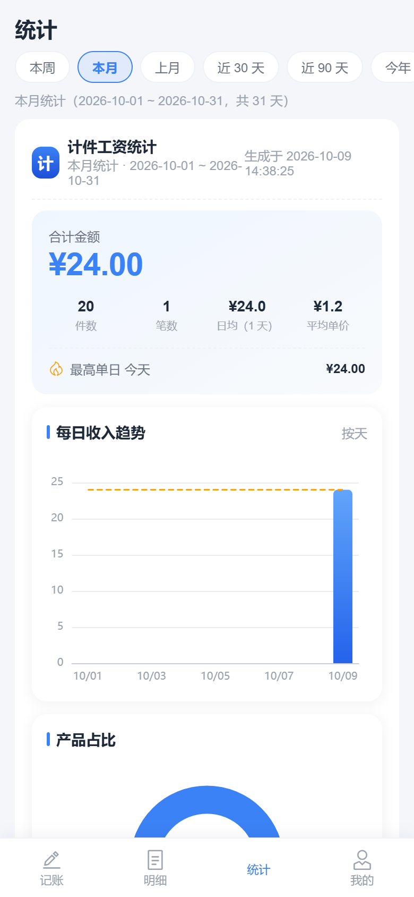
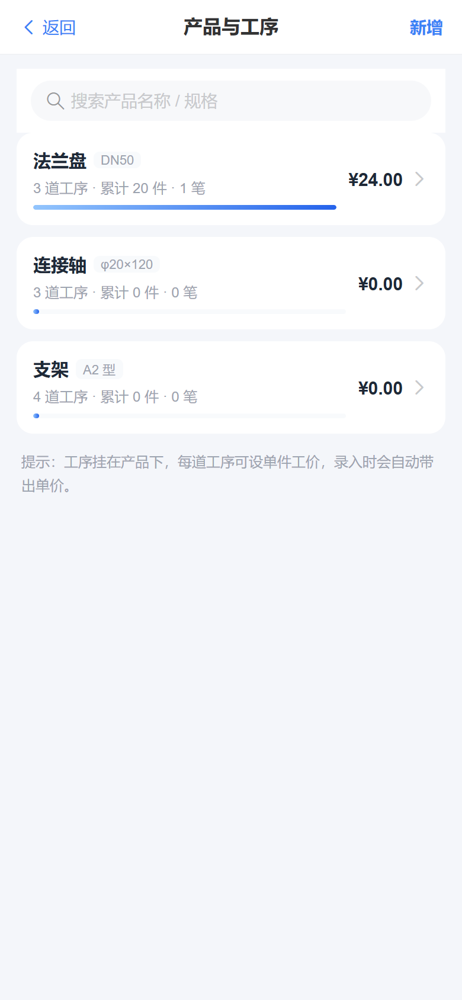
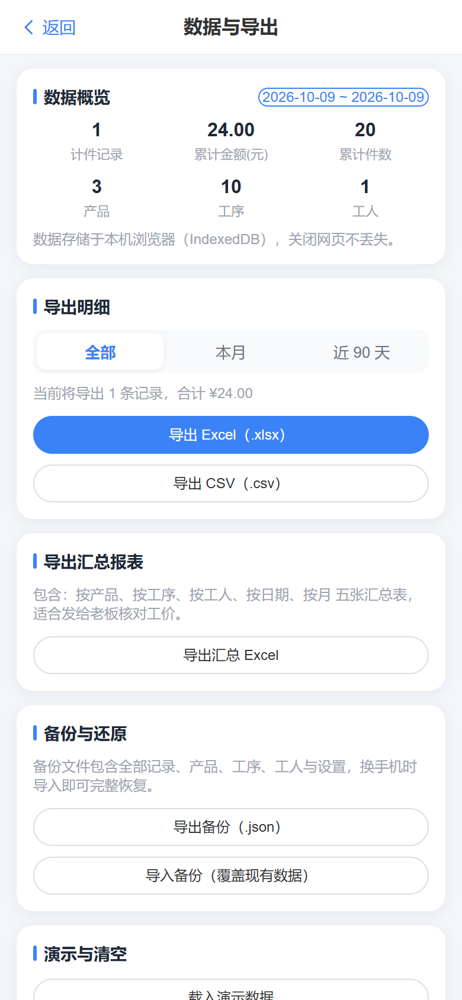

# 计件工资记账 · 移动端 PWA

一个面向车间/工厂计件场景的**移动端记账 Web App（PWA）**：手机浏览器打开即可使用，
**无需安装、无需登录、数据全部保存在本机浏览器（IndexedDB）**，断网也能继续用。

> 产品定位：比「安心计件」更完善、上手更低 —— 快速记账、明细筛选、多维度统计图表、
> 一键导出 Excel/CSV、本地备份与还原、深浅色主题。

## 截图预览

以下截图取自本项目实际运行界面。

| 首页 | 快速记账 |
| --- | --- |
|  |  |
| 今日 / 本周 / 本月金额概览与最近记录 | 产品、工序、数量与自动带出的单价 |

| 明细 | 统计 |
| --- | --- |
|  |  |
| 多条件筛选与批量导出 | 收入趋势、产品占比与收入排行 |

| 产品与工序 | 数据与导出 |
| --- | --- |
|  |  |
| 产品、工序与单价维护 | Excel / CSV / 备份 JSON 导入导出 |

| 我的 |
| --- |
|  |
| 主题切换、默认工人与个人偏好 |

---

## 一、技术栈

| 类别 | 选型 |
| --- | --- |
| 构建 | Vite 5 |
| 框架 | Vue 3（`<script setup>` + TypeScript） |
| 路由 | Vue Router 4（Hash 模式，静态托管免配置） |
| UI | Vant 4（移动端组件库） |
| 状态 | Pinia |
| 本地存储 | localForage（IndexedDB，带降级） |
| 图表 | ECharts 5 + vue-echarts（按需注册） |
| 导出 | xlsx（Excel）、原生 Blob（CSV/JSON）、html2canvas（统计长图） |
| PWA | vite-plugin-pwa（自动更新 Service Worker、离线预缓存、可添加到主屏幕，安装说明见「添加到主屏幕」章节） |

---

## 二、目录结构

```
jijian-pwa/
├─ index.html                 # 入口 HTML（含启动闪屏）
├─ vite.config.ts             # Vite 配置：base './'、PWA 清单、分包、别名 '@'
├─ tsconfig.json / tsconfig.node.json
├─ package.json
├─ .github/workflows/deploy.yml   # GitHub Pages 自动构建部署工作流
├─ public/                    # PWA 图标、favicon
└─ src/
   ├─ main.ts                 # 应用挂载、Vant 注册、移除闪屏
   ├─ App.vue                 # 根壳：主题、TabBar 显隐、路由出口
   ├─ router/index.ts         # 路由表（4 个 Tab + 记录/产品/工人/数据/关于等子页）
   ├─ stores/app.ts           # Pinia：记录、产品、工序、工人、设置的增删改查与备份还原
   ├─ db/index.ts             # localForage 持久层、默认设置、导入导出
   ├─ types/index.ts          # 领域模型类型定义
   ├─ utils/
   │  ├─ date.ts              # 本地时区日期工具（今日/区间/周月/偏移）
   │  ├─ format.ts            # 金额、数量、日期格式化
   │  ├─ stats.ts             # 聚合统计：按产品/工序/工人/班次/日期、日均、最佳日、分桶
   │  └─ exporter.ts          # Excel / CSV / JSON 导出
   ├─ components/             # TabBar、分段控件、空状态、统计块、日期选择、记录项、快速记账弹层
   ├─ views/                  # 首页、明细、统计、我的、记录编辑/详情、产品、产品详情、工人、数据、关于
   ├─ plugins/echarts.ts      # ECharts 按需注册
   └─ styles/                 # 主题变量（浅色/深色）与全局样式
```

---

## 三、功能一览

**记账（首页）**
- 顶部今日/本周/本月金额概览，最近记录列表
- 底部“＋”唤起快速记账弹层：产品 → 工序 → 数量步进 → 自动带出单价 → 班次/工人/备注
- 记住上次使用的产品与工序，连续记账更快

**明细**
- 按日期区间 / 产品 / 工人 / 班次筛选，按日期分组展示
- 长按或勾选进入多选，批量导出选中记录
- 单条记录查看详情、编辑、删除

**统计**
- 区间：本周 / 本月 / 上月 / 近 30 天 / 近 90 天 / 年度 / 自定义
- 合计金额、件数、笔数、日均、平均单价、最高单日
- 每日（区间 >62 天自动按月）收入趋势图、产品占比饼图、工序收入排行、工人收入排行
- 一键导出统计长图（PNG）与统计 Excel（明细 + 5 张汇总表）

**我的**
- 产品与工序管理（增删改、单价设置、规格）
- 工人管理（从记录中维护常用工人名单）
- 数据与导出：Excel / CSV / 汇总报表 / 备份 JSON / 导入还原 / 演示数据 / 清空
- 主题切换（跟随系统 / 浅色 / 深色）、默认工人、记住上次选择
- 关于与「添加到主屏幕」的安装说明

---

## 四、开发与构建

```powershell
npm install          # 安装依赖
npm run dev          # 开发模式 http://localhost:5173（已开启 host，手机同局域网可访问）
npm run type-check   # TypeScript 类型检查
npm run build        # 类型检查 + 生产构建，产物在 dist/
npm run preview      # 本地预览构建产物 http://localhost:4173
```

要求 Node.js 18+（本项目在 Node 24 / npm 11 下验证通过）。

---

## 五、部署

部署到 GitHub Pages 的完整步骤见项目外层交付的 **《GitHub-Pages-部署说明.md》**。
简要说明：

- 仓库中已包含 `.github/workflows/deploy.yml`，推到 `main` 并在
  Settings → Pages 选择 **GitHub Actions** 即自动部署；
- 也可直接把 `dist/` 内的文件上传到 Pages 分支根目录（`base: './'`，子路径可直接运行）；
- `dist/.nojekyll` 用于关闭 GitHub Pages 的 Jekyll 处理。

---

## 六、数据说明

- 所有数据仅保存在当前浏览器的 IndexedDB 中，**不上传任何服务器**；
- 更换设备、更换浏览器或清理浏览器数据会造成数据丢失，请定期
  「我的 → 数据与导出 → 导出备份」保存 `.json` 备份文件；
- 备份文件包含全部记录、产品、工序、工人与设置，导入即可完整恢复。

## 添加到主屏幕

本项目是 PWA（渐进式 Web 应用）。只有添加到主屏幕后，才能获得接近原生应用的使用体验；
在未添加的情况下，它仍然只是一个运行在浏览器里的网页。

**为什么必须使用 Chrome 浏览器**

- 请使用 Chrome 浏览器（手机版 Chrome 等）打开站点并执行「添加到主屏幕」。
  只有在这种方式下，应用才能以独立窗口运行、支持离线使用，并在主屏幕生成启动图标，
  使用体验最接近原生应用。
- 通过其它方式访问时（例如微信等应用的内置浏览器、直接把网址当普通网页打开），
  **本质上只是一个普通网页**：没有独立窗口与启动图标，离线能力与数据可靠性都较差，
  不建议作为日常使用方式。

**操作步骤**

1. 使用 Chrome 浏览器打开站点：https://wdre9.github.io/jijian-pwa/
2. 点击右上角的三点菜单（⋮）。
3. 在菜单中向下滑动，选择「添加到主屏幕」。
4. 按提示确认后，主屏幕会出现应用图标，之后从该图标启动即可。

**数据安全提示**

- 本应用本质上运行在浏览器里，数据保存在当前浏览器的 IndexedDB 中；
  浏览器或系统在清理缓存、清理站点数据（含存储空间不足时的自动清理）等情况下，
  可能一并清除这些数据，且无法恢复。
- 请务必定期通过「我的 → 数据与导出 → 导出备份」保存 `.json` 备份文件，
  并另外保存到手机以外的地方（如电脑、云盘）。
- 在清除浏览器缓存、卸载浏览器、更换设备或更换浏览器之前，请先导出备份。

---

## 七、贡献

欢迎参与本项目。提交 Issue 或 Pull Request 之前，建议先阅读：

- [贡献指南](CONTRIBUTING.md)：开发环境、分支与提交约定、Pull Request 流程
- [行为准则](CODE_OF_CONDUCT.md)：社区交流的基本约定
- [安全政策](SECURITY.md)：漏洞上报方式与处理时限

问题反馈请使用 Issue 模板：https://github.com/wdre9/jijian-pwa/issues/new/choose
代码变更请按 Pull Request 模板填写变更说明与验证方式。

---

## 八、许可证

本项目基于 [MIT 许可证](LICENSE) 开源，版权归 wdre9 所有（2026）。

---

## 九、更新日志

版本变更记录见 [CHANGELOG.md](CHANGELOG.md)。

